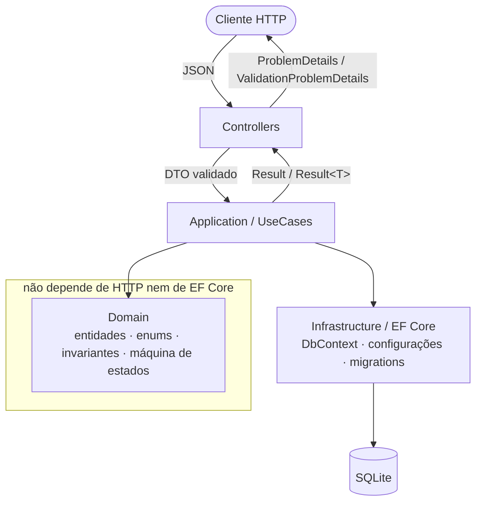
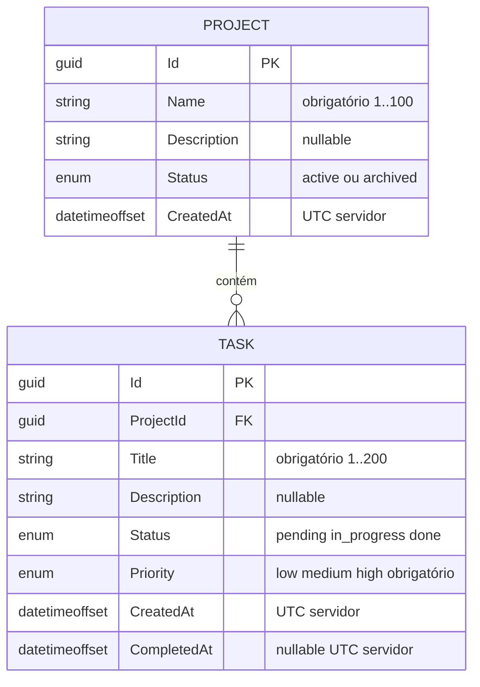
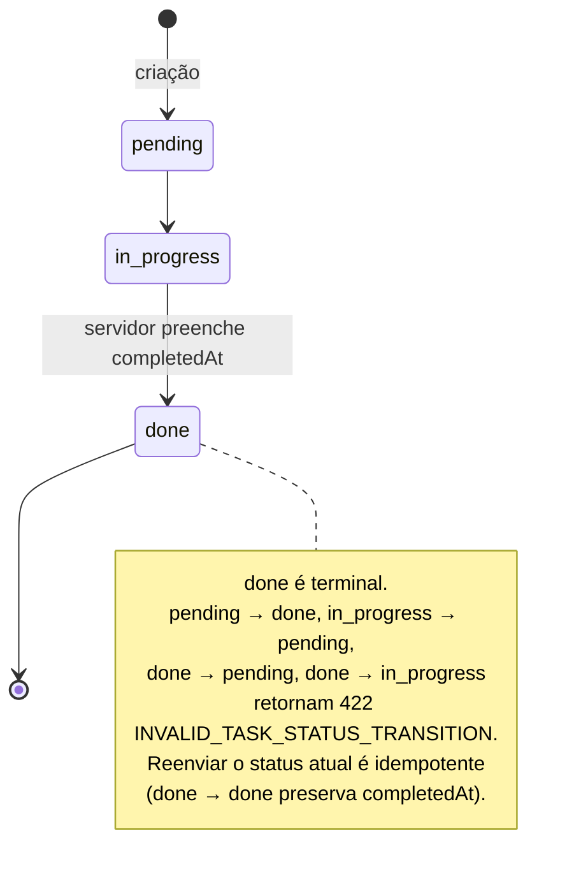
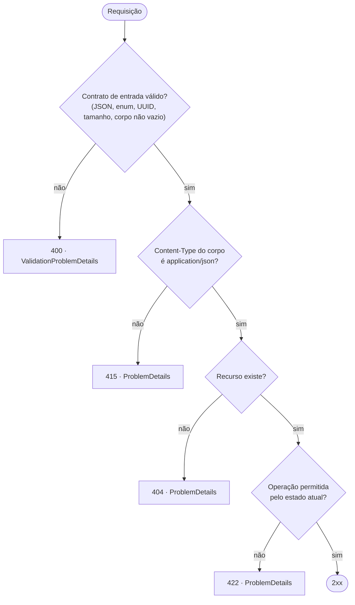

# TaskFlow API

API REST para gerenciamento de projetos e tarefas colaborativas, desenvolvida
com **Specification-Driven Development (SDD)**: o contrato
[`openapi.yaml`](openapi.yaml) foi definido e revisado antes da implementação e
permanece como fonte da verdade para código e testes.

## Início rápido

```bash
# 1. restaurar dependências
dotnet restore

# 2. executar a API (http://localhost:5000)
dotnet run --project src/TaskFlow.Api

# 3. executar os testes de contrato
dotnet test tests/TaskFlow.ContractTests
```

O banco SQLite (`taskflow.db`) é criado e migrado automaticamente no startup.
Nenhuma infraestrutura externa é necessária.

## Objetivo

Fornecer uma API previsível e testável para projetos e tarefas, com regras de
ciclo de vida explícitas, erros HTTP bem classificados e aderência verificável
ao contrato OpenAPI.

## Desafio

Implementar, sobre a stack .NET 8 / ASP.NET Core / EF Core / SQLite, oito
operações REST cobrindo:

- criação, listagem, consulta e atualização parcial de projetos;
- criação, listagem, atualização parcial e exclusão de tarefas dentro de um
  projeto;
- regras de negócio de arquivamento de projeto, exclusão de tarefa e máquina de
  estados da tarefa;
- respostas de erro em `application/problem+json` com código estável.

Autenticação e autorização estão fora do escopo (`security: []` no contrato).

## Specification-Driven Development

O fluxo de trabalho é:

```text
OpenAPI  ->  revisão do contrato  ->  testes de contrato  ->  implementação
```

Mudanças de comportamento começam pelo `openapi.yaml`. Uma divergência entre
código, testes e contrato é tratada como defeito. O histórico de decisões e
revisões está em [`docs/decisoes.md`](docs/decisoes.md) e
[`ai/revisoes.md`](ai/revisoes.md).

## OpenAPI como fonte da verdade

- [`openapi.yaml`](openapi.yaml) descreve rotas, schemas, enums, nulabilidade,
  status, headers e exemplos de erro.
- Os testes carregam o próprio `openapi.yaml` e validam cada resposta real da
  API contra o schema localizado por `path + método + status + media type`
  (`JsonSchema.Net`), sem duplicar schema no código de teste.
- A documentação gerada em runtime é uma representação do contrato, nunca uma
  segunda fonte.

## Arquitetura

Arquitetura em camadas simples, proporcional ao escopo (não é Clean
Architecture completa):



| Camada | Responsabilidade |
|---|---|
| Controllers | routing, binding, validação de entrada, tradução do resultado para HTTP |
| Application / UseCases | orquestração, persistência, verificação de existência, coordenação das regras |
| Domain | entidades, enums, invariantes, transições de estado |
| Infrastructure | `DbContext`, configurações EF Core, migrations, SQLite |

- Controllers não contêm regra de negócio.
- Um caso de uso por operação; erros de domínio propagados via `Result` /
  `Result<T>`, sem exceções para controle de fluxo.
- Domain não depende de HTTP nem de EF Core.
- Sem MediatR, Repository genérico, Unit of Work próprio ou AutoMapper.

## Estrutura do projeto

```text
TaskFlow/
├─ openapi.yaml                     # contrato (fonte da verdade)
├─ TaskFlow.sln
├─ src/TaskFlow.Api/
│  ├─ Controllers/                  # ProjectsController, TasksController
│  ├─ Application/                  # casos de uso (Projects/, Tasks/)
│  ├─ Contracts/                    # DTOs de request/response, Optional<T>
│  ├─ Domain/                       # Entities, Enums, Errors, Result
│  ├─ Infrastructure/
│  │  ├─ Persistence/               # DbContext, configurations, migrations
│  │  ├─ Serialization/             # conversores JSON (enum, Optional<T>)
│  │  ├─ ModelBinding/              # binder de UUID canônico
│  │  └─ Http/                      # TaskFlowProblemDetailsFactory
│  └─ Program.cs
├─ tests/TaskFlow.ContractTests/    # xUnit + WebApplicationFactory + SQLite isolado
│  ├─ Support/                      # TaskFlowApiFactory, OpenApiResponseValidator
│  ├─ Contract/                     # happy path, erros 400/404/422, fronteiras, cobertura OpenAPI
│  ├─ Endpoints/                    # suítes por recurso (Projects, Tasks)
│  └─ Unit/                         # máquina de estados do domínio, ProblemDetails factory
├─ docs/decisoes.md                 # decisões técnicas e trade-offs
├─ ai/                              # uso de IA: prompts.md, skills.md, revisoes.md
└─ .agents/skills/taskflow-sdd/     # skill que fixa o fluxo SDD e as regras do contrato para o agente
```

## Modelo de dados



| Campo | Regra |
|---|---|
| `Project.Status` | `active` (default) \| `archived` |
| `Task.Status` | `pending` (default) \| `in_progress` \| `done` |
| `Task.Priority` | `low` \| `medium` \| `high` (obrigatório) |

- SQLite, uma tabela por entidade; enums persistidos como `TEXT`.
- FK `Task.ProjectId -> Project.Id` com `ON DELETE RESTRICT`.
- Índices em `Project.Status` e em `(Task.ProjectId, Status, Priority)` para os filtros de listagem.
- `Id` é UUID gerado no domínio (`Guid.NewGuid()`), não pelo banco.
- `CreatedAt` / `CompletedAt` são definidos pelo servidor e são `readOnly` no contrato.

## Tecnologias

| Área | Tecnologia |
|---|---|
| Runtime | .NET 8 (LTS) |
| Web | ASP.NET Core Web API (Controllers) |
| Persistência | Entity Framework Core 8 + SQLite |
| Serialização | System.Text.Json (camelCase, enums em `snake_case`) |
| Erros | `ProblemDetails` / `ValidationProblemDetails` |
| Contrato | OpenAPI 3.0.3, servido em runtime pela Swagger UI (`Swashbuckle.AspNetCore.SwaggerUI`) sem geração a partir do código |
| Testes | xUnit, `WebApplicationFactory<Program>`, `JsonSchema.Net`, `Microsoft.OpenApi.YamlReader` |

## Pré-requisitos

- [.NET SDK 8.0](https://dotnet.microsoft.com/download/dotnet/8.0)
- Opcional: `dotnet tool install --global dotnet-ef` (apenas para gerar novas
  migrations; as existentes são aplicadas automaticamente no startup)

Verifique o SDK:

```bash
dotnet --version   # 8.0.x
```

## Restaurar dependências

```bash
dotnet restore
```

## Executar

```bash
dotnet run --project src/TaskFlow.Api
```

- Base URL: `http://localhost:5000`
- Swagger UI: `http://localhost:5000/swagger` (renderiza o próprio
  [`openapi.yaml`](openapi.yaml), também exposto em `/openapi.yaml`)
- Banco: `src/TaskFlow.Api/taskflow.db` (criado e migrado no startup)
- Para reiniciar do zero, pare a API e apague `taskflow.db*`.

Fluxo ponta a ponta (criar projeto → tarefa → iniciar → concluir):

```bash
BASE=http://localhost:5000

PID=$(curl -s "$BASE/projetos" -H 'Content-Type: application/json' \
  -d '{"name":"Plataforma TaskFlow","description":"Gestão colaborativa"}' \
  | python -c 'import sys,json;print(json.load(sys.stdin)["id"])')

TID=$(curl -s "$BASE/projetos/$PID/tarefas" -H 'Content-Type: application/json' \
  -d '{"title":"Implementar autenticação","priority":"high"}' \
  | python -c 'import sys,json;print(json.load(sys.stdin)["id"])')

curl -s -X PATCH "$BASE/tarefas/$TID" -H 'Content-Type: application/json' -d '{"status":"in_progress"}'
curl -s -X PATCH "$BASE/tarefas/$TID" -H 'Content-Type: application/json' -d '{"status":"done"}'
# -> status "done" e completedAt preenchido: 2026-08-30T21:04:29.467Z
```

## Executar testes

```bash
dotnet test tests/TaskFlow.ContractTests
```

A suíte sobe a aplicação real via `WebApplicationFactory<Program>` sobre um
SQLite in-memory isolado por fixture (sem EF InMemory).

## Validação do openapi.yaml

A especificação é validada pela própria suíte de testes, sem passo externo:

- `Microsoft.OpenApi.YamlReader` carrega o `openapi.yaml` 3.0.3 e resolve todas
  as `$ref` ao executar os testes; um documento malformado ou com referência
  quebrada faz a suíte falhar.
- `JsonSchema.Net` valida cada resposta real da API contra o schema do contrato,
  localizado por `path + método + status + media type`.

```bash
dotnet test tests/TaskFlow.ContractTests
```

A Swagger UI (`/swagger`) apenas renderiza esse mesmo arquivo; o contrato não é
gerado a partir do código.

## Endpoints

Base: `http://localhost:5000`

| Método | Rota | Descrição | Sucesso | Erros |
|---|---|---|---|---|
| `POST` | `/projetos` | Criar projeto (`status` inicial `active`) | `201` + `Location` | `400`, `415` |
| `GET` | `/projetos?status=` | Listar projetos, filtro opcional por `status` | `200` | `400` |
| `GET` | `/projetos/{id}` | Buscar projeto por ID | `200` | `400`, `404` |
| `PATCH` | `/projetos/{id}` | Atualizar parcialmente `name`, `description`, `status` | `200` | `400`, `404`, `415`, `422` |
| `POST` | `/projetos/{id}/tarefas` | Criar tarefa (`status` inicial `pending`) | `201` + `Location` | `400`, `404`, `415`, `422` |
| `GET` | `/projetos/{id}/tarefas?status=&priority=` | Listar tarefas do projeto, filtros combináveis | `200` | `400`, `404` |
| `PATCH` | `/tarefas/{id}` | Atualizar parcialmente `title`, `description`, `status`, `priority` | `200` | `400`, `404`, `415`, `422` |
| `DELETE` | `/tarefas/{id}` | Excluir tarefa | `204` | `400`, `404`, `422` |

Enums do contrato: `ProjectStatus` = `active` \| `archived`;
`TaskStatus` = `pending` \| `in_progress` \| `done`;
`TaskPriority` = `low` \| `medium` \| `high`.

## Regras de negócio

### Máquina de estados da tarefa



### Demais regras

- Um projeto só pode ser arquivado se **não** possuir tarefa `in_progress`
  (`422 PROJECT_HAS_IN_PROGRESS_TASKS`).
- Não é permitido criar tarefa em projeto arquivado
  (`422 PROJECT_ARCHIVED`).
- Fluxo de status da tarefa: `pending -> in_progress -> done`.
  - Retrocesso proibido; `done` é terminal.
  - `pending -> done` direto é proibido
    (`422 INVALID_TASK_STATUS_TRANSITION`).
- Ao entrar em `done`, o servidor preenche `completedAt` (UTC). O campo é
  `readOnly`; `done -> done` preserva o valor original.
- Somente tarefa `pending` pode ser excluída
  (`422 TASK_CANNOT_BE_DELETED`).
- Reenviar o estado atual é idempotente.
- PATCH distingue campo ausente (mantém), campo presente (atualiza) e campo
  `null` (aplica quando o schema permite), via `Optional<T>`. O body deve ter
  ao menos uma propriedade reconhecida; propriedades desconhecidas são
  rejeitadas com `400`.

Ordem de avaliação dos erros: **contrato de entrada -> existência do recurso ->
regra de negócio**.

## ProblemDetails

Todos os erros usam `Content-Type: application/problem+json`.



| Status | Uso | Corpo |
|---|---|---|
| `400` | Entrada inválida (JSON, enum, UUID, tamanho, PATCH vazio, campo desconhecido) | `ValidationProblemDetails` com `errors` por campo |
| `404` | UUID válido sem recurso correspondente | `ProblemDetails` |
| `415` | `Content-Type` do corpo diferente de `application/json` | `ProblemDetails` (`code` `UNSUPPORTED_MEDIA_TYPE`) |
| `422` | Operação válida barrada pelo estado atual | `ProblemDetails` |

Campos: `type`, `title`, `status`, `detail`, `instance` e `code` estável e
legível por máquina (ex.: `PROJECT_NOT_FOUND`, `INVALID_TASK_STATUS_TRANSITION`).
Detalhes internos, SQL e stack traces não são expostos.

## Decisões técnicas principais

Detalhes em [`docs/decisoes.md`](docs/decisoes.md).

- **SDD com OpenAPI 3.0.3** (versão pedida no item 1.1 do desafio) como fonte da
  verdade; contrato congelado durante a implementação. Campos anuláveis usam
  `nullable: true`.
- **Transição de tarefa — leitura estrita:** concluir exige passar por
  `in_progress`. O atalho `pending -> done` retorna `422`; apenas o retrocesso é
  proibido pelo enunciado, mas o fluxo `pending -> in_progress -> done` é tratado
  como obrigatório em cada etapa. Decisão explícita, refletida no `openapi.yaml`
  e nos testes.
- **EF Core + SQLite**, `DbContext` como unidade de trabalho; sem Repository/UoW
  adicionais. Migrations aplicadas no startup (proporcional ao cenário local).
- **EF InMemory descartado** nos testes por não reproduzir SQL, constraints e
  transações reais.
- **PATCH** com `application/json` e presença explícita (`Optional<T>`); JSON
  Patch (RFC 6902) não é usado por não estar no contrato.
- **Erros** centralizados em `TaskFlowProblemDetailsFactory`, com classificação
  `400` / `404` / `422`.
- **Tempo** via `TimeProvider` (sem `DateTime.Now/UtcNow`); `DateTimeOffset` em
  UTC, serializado em RFC 3339 com milissegundos e sufixo `Z`
  (`2026-08-30T21:04:29.467Z`).
- **Enums** serializados como string `snake_case` (`in_progress`), com conversor
  estrito que rejeita variações.
- **UUID** de rota aceito apenas no formato canônico (`D`); fora disso, `400`.
- **Comprimento de string** contado em runes (Unicode), não UTF-16.
- Abstrações não adotadas: MediatR, Repository genérico, Unit of Work próprio,
  AutoMapper, mensageria, event sourcing, sagas, microservices.

## Testes de contrato

**120 testes**, executando os oito endpoints pela aplicação real
(`WebApplicationFactory<Program>`).

- Cada resposta é validada contra o schema do `openapi.yaml`
  (`path + método + status + media type`), sem schema duplicado nos testes.
- Cobrem happy path, `400` / `404` / `415` / `422`, máquina de estados, ausência
  de body em `204`, e fronteiras de casing, Unicode, UUID canônico, media type e
  preservação de `completedAt` em `done -> done`.
- Um teste comprova a aplicação da migration em um SQLite vazio e a ausência de
  migrations pendentes.
- Organização: `Support/` (infra), `Contract/` (aderência transversal),
  `Endpoints/` (por recurso), `Unit/` (domínio e factory de erros).

## Uso de IA

O desenvolvimento foi apoiado por IA em análise de requisitos, identificação de
ambiguidades, redação do OpenAPI, revisão da especificação, proposta de
arquitetura, modelagem de domínio, EF Core, `ProblemDetails`, testes, validação
de contrato, code review e documentação.

As decisões técnicas, a aceitação de trade-offs e a incorporação ou rejeição de
cada sugestão permaneceram sob responsabilidade do desenvolvedor. O registro
completo está em [`ai/skills.md`](ai/skills.md),
[`ai/prompts.md`](ai/prompts.md) e [`ai/revisoes.md`](ai/revisoes.md).

O fluxo SDD e as regras do contrato ficam versionados como um skill do agente em
[`.agents/skills/taskflow-sdd/SKILL.md`](.agents/skills/taskflow-sdd/SKILL.md):
guarda o OpenAPI como fonte da verdade e a semântica de erros, PATCH, máquina de
estados e persistência para qualquer alteração futura no repositório.

## Limitações e trade-offs

Aceitos conscientemente para manter a solução proporcional ao escopo:

- **SQLite**: adequado para execução local e o desafio; não é decisão de banco
  para alta escala.
- **Concorrência**: sem ETag, row version ou `409`. Atualizações concorrentes
  seguem last-write-wins.
- **Paginação**: listagens retornam o array completo; o contrato não define
  paginação.
- **Auditoria**: existem `createdAt` e `completedAt`, mas não `updatedAt`, ator
  da mudança ou histórico de transições.
- **Exclusão** de tarefa é física; não há soft delete.
- **Segurança**: sem autenticação/autorização; adequado apenas ao ambiente
  controlado do desafio.
